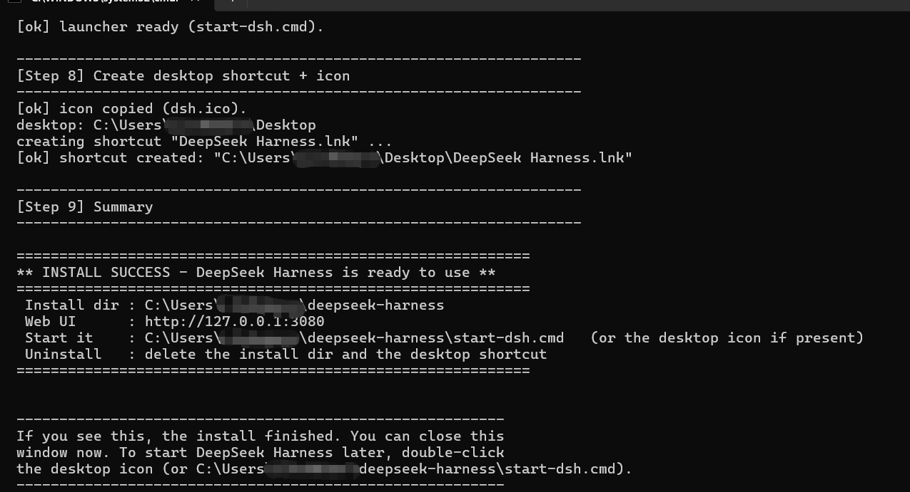
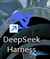
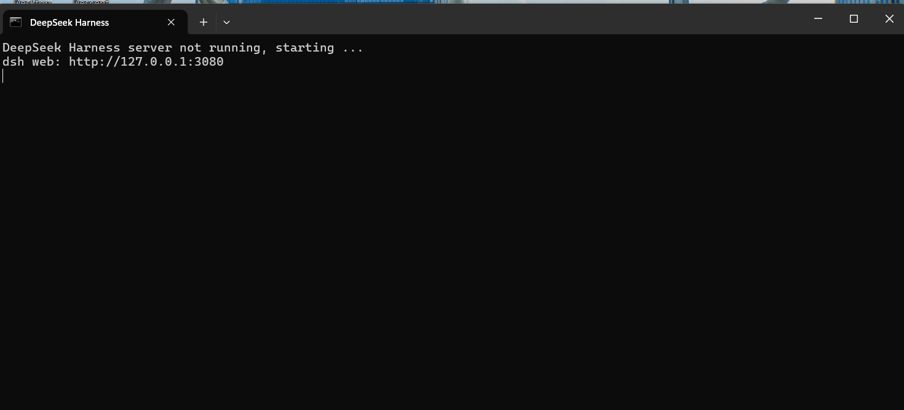

# DeepSeek Harness — Windows 一键安装器

**中文** | [**English**](README.en.md)

---

> **完全开源**：这个安装器的每一行都是纯文本脚本（`.cmd` / `.mjs`），没有任何编译出来的东西、也没有任何隐藏内容。你可以打开任何一个文件，从头看到尾，确认它到底做了什么再运行。

为 [DeepSeek Harness](https://github.com/deepseek-ai/deepseek-harness)（DeepSeek 官方开源框架）提供的一键安装脚本。

## 使用

**安装：** 双击 `install-dsh.cmd`，等待完成即可。全程自动：检测依赖 → 下载官方源码 → 安装构建 → 创建桌面快捷方式。

**启动：** 安装完成后，双击桌面 **DeepSeek Harness** 图标，浏览器会自动打开使用界面。

> 想先看它会执行什么？运行 `install-dsh.cmd --dry-run`（只预览，不做任何改动）。

## 安装到使用，就这三步

下面的截图来自我自己在电脑上手动装的一次，不是演示图，是真实的过程。

**1. 双击 `install-dsh.cmd`，等它跑完，看到 INSTALL SUCCESS 就是装好了**

**2. 桌面上多了一个 DeepSeek Harness 图标**

**3. 双击这个图标，它会启动服务器，然后浏览器打开 http://127.0.0.1:3080 就能用 dsh 了**

整个过程不用装别的软件，也不用碰命令行——双击、等、再双击，就这三下。

## 说明

- **脚本化安装**：所有安装逻辑都是纯文本脚本（`.cmd` / `.mjs`），不是编译好的程序
- **完全开源**：仓库里每一行都可以逐行阅读、审计，没有任何隐藏内容
- **零预装**：缺 git / Node.js 会自动下载自包含副本，不装系统、删目录即卸载
- **无需管理员**：不修改注册表、不改系统 PATH、不装系统服务
- **卸载**：删除安装目录（默认 `%USERPROFILE%\deepseek-harness`）和桌面图标即可

## 许可

[MIT](LICENSE)

---

*DeepSeek Harness 是 DeepSeek AI 的开源项目。本安装器是社区脚本，与 DeepSeek 官方无隶属关系。*
